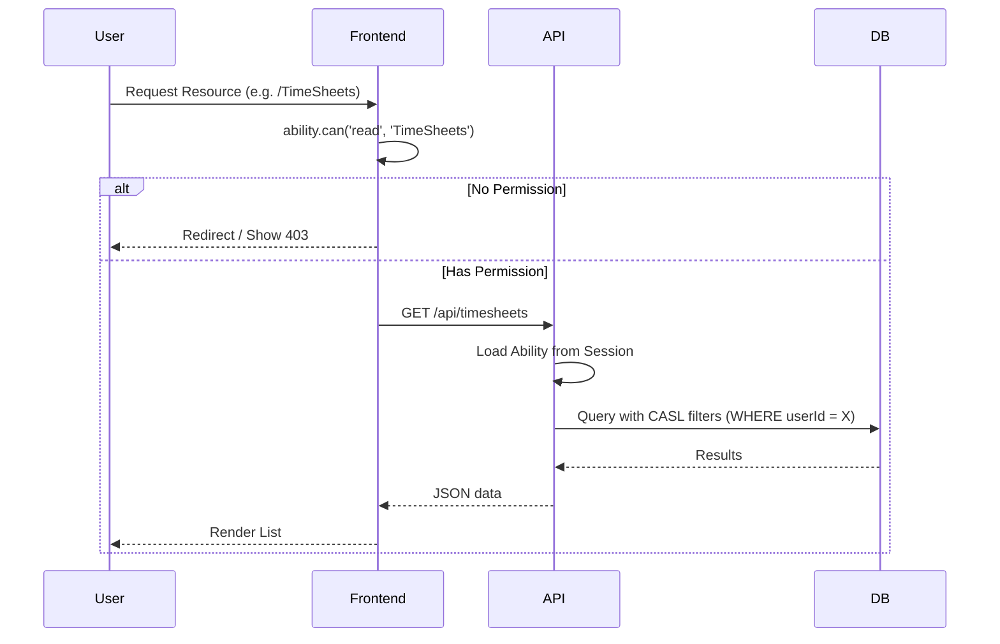

# Access Control Specification (RBAC & ABAC)

## Overview
Casa Familiar implements a **Hybrid Access Control** model combining **Role-Based Access Control (RBAC)** and **Attribute-Based Access Control (ABAC)**. 

The system leverages **CASL** (Control Access Security Library) to enforce permissions consistently across the stack:
1.  **Backend (Hono)**: Hard enforcement using `ability.factory.ts`.
2.  **Frontend (Refine)**: UI adaptation via `accessControlProvider`.

## Roles & Definitions

| Role | Key | Priority | Description |
| :--- | :--- | :--- | :--- |
| **Admin** | `admin` | Highest | Full manage access to all resources and system settings. |
| **HR / Supervisor** | `hr` | High | Can manage employees, time-off requests, and audits timesheets. |
| **Supervisor (Flag)**| `isSupervisor` | Medium | In addition to their base role, they can access the Supervisor Dashboard and manage direct reports. |
| **User (Employee)** | `user` | Base | Standard access based on assigned `allowed_screens`. |

## Core Architecture: CASL Integration

### 1. Subject Standardization
Resources are standardized to match Refine's pluralized names for consistency:
- `TimeSheets`
- `TimeOff`
- `employees`
- `it-category`
- `CompanyCalendar`
- `Supervisor`

### 2. Action Aliases
We use aliases to decouple UI actions (Refine) from logical permissions:
- **`read`**: Maps to `list` and `show`.
- **`update`**: Maps to `edit`.
- **`manage`**: Maps to any action.

### 3. ABAC (Ownership & Hierarchy)
Beyond simple roles, we enforce rules based on record attributes:
- **Ownership**: Users can only `read`/`update`/`delete` their own `TimeSheets` and `TimeOff` entries (enforced by `userId`).
- **Hierarchy**: Supervisors can access `TimeSheets` of users listed in their `directReports` array.
- **Workflow State**: Users can only `update` or `delete` `TimeSheets` if the status is `draft`.

## Implementation Details

### Frontend Layer
*Location: `mi-casa/src/auth/ability.ts` & `mi-casa/src/App.tsx`*

The `accessControlProvider` uses a memoized CASL `ability` instance. It passes the resource data (if available) to CASL for attribute-level checks.

### Backend Layer
*Location: `mi-casa-server/src/modules/auth/casl/ability.factory.ts`*

The backend constructs the same `ability` object during the authentication middleware. This object is used in controllers/services to filter database results and validate mutations.

## 🔗 Related Documentation
For implementation details and code examples, see:
- [CASL Security Guide](file:///SECURITY_GUIDE_CASL.md)
- [Frontend Access Control Guide](file:///SECURITY_GUIDE_FRONTEND_CASL.md)
- [Advanced CASL Patterns](file:///ADVANCED_CASL_PATTERNS.md)

## Authorization Flow Diagram

