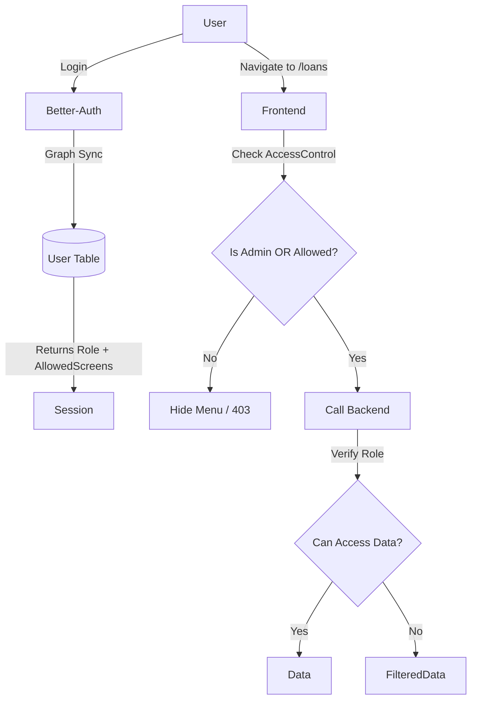

# Role-Based Access Control (RBAC) Technical Specification

## Overview
This document outlines the Upgrade Role-Based Access Control (RBAC) architecture implemented in the Casa Familiar application. The security model is implemented in three layers:
1.  **Backend (Data Enforcement)**: Strict data filtering based on roles.
2.  **Frontend (Presentation)**: UI adaptation using `AccessControlProvider`.
3.  **Granular Permissions**: Specific screen-level access via `allowed_screens`.

## Roles & Definitions

| Role | Key | Description |
| :--- | :--- | :--- |
| **Admin** | `admin` | Full access to all modules, settings, and User Management. |
| **HR Manager** | `hr`, `hr_manager` | Access to all employee data, timesheets, and HR modules. |
| **Supervisor** | `isSupervisor: true` | Access to own data + strict read/write access to **Direct Reports**. |
| **Employee** | `user` | Access limited to own data + assigned screens. |

## 1. Backend Security Layer (NodeJS/Hono)
*Location: `mi-casa-server/src/modules/timesheets/timesheets.controller.ts`*

The backend accepts the authentication cookie (`HttpOnly`), decodes the session, and enforces permissions **before** querying the database.

### Logic Flow
When a `GET /api/timesheets` request is received:

1.  **Authentication**: Middleware validates session cookie.
2.  **Role Check**:
    *   **If Admin/HR**: Request is approved. Query filters (`employee_email`) are respected.
    *   **If Supervisor**:
        *   System retrieves `directReports` from the session.
        *   **Enforcement**: Requested data is intersected with `[Self + Direct Reports]`.
    *   **If Employee**:
        *   **Enforcement**: System forcibly sets `employee_email = [CurrentUser.Email]`.

## 2. Frontend Granular Access (React/Refine)
*Location: `early-lamps-fly/src/App.tsx` & `authStore.ts`*

We support a **Hybrid RBAC** model. A user can have a Role AND/OR specific list of allowed screens.

### Database Schema
The `user` table includes an `allowed_screens` column (JSON Text), e.g., `['loans', 'TimeSheets']`.

### Access Control Logic
```typescript
can: async ({ resource }) => {
  // 1. Admin Override
  if (role === 'admin') return { can: true };

  // 2. Supervisor Special Case
  if (resource === "Supervisor") {
    return { can: isSupervisor || role === 'hr' || allowedScreens.includes('Supervisor') };
  }

  // 3. Granular Screen Check
  // Allow if the resource is explicitly listed in the user's allowed_screens list
  if (allowedScreens.includes(resource)) return { can: true };

  // 4. Defaults
  // Some modules like Dashboard might be allowed by default.
  return { can: false };
}
```

## 3. User Management Interface
*Location: `/admin/users`*

Admins have access to a dedicated **Employee Management** screen where they can:
1.  See a list of all users.
2.  Promote/Demote users (change Role).
3.  Grant/Revoke specific screen access (edit `allowed_screens`).

> **Bootstrapping Note**: To create the *first* Admin, you must update the database manually:
> ```sql
> UPDATE "user" SET role = 'admin' WHERE email = 'your-email@example.com';
> ```

## Diagram


